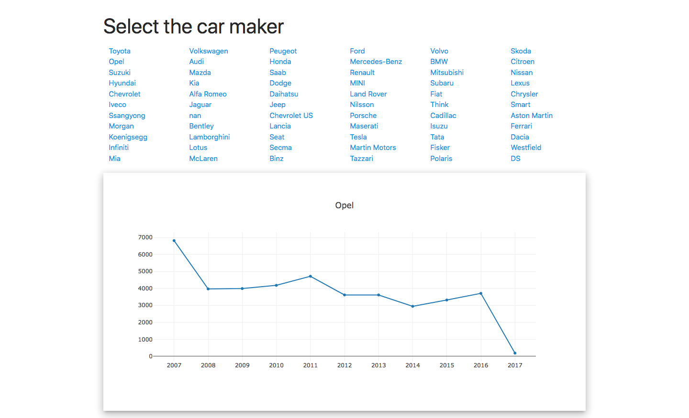
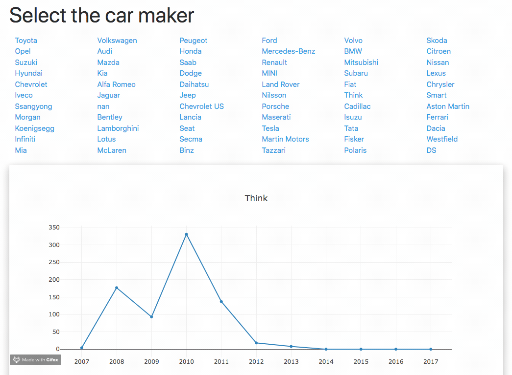

# NorwayCars

Main idea of this project is to learn how to handle Django + ajax + pandas + plotly.

I found open data set https://www.kaggle.com/dmi3kno/newcarsalesnorway/home, downloaded it and started to develope a project.






### installing dependencies from file
```bash
$ pip install -r requirements.txt
```

### run

```bash
python manage.py runserver
```